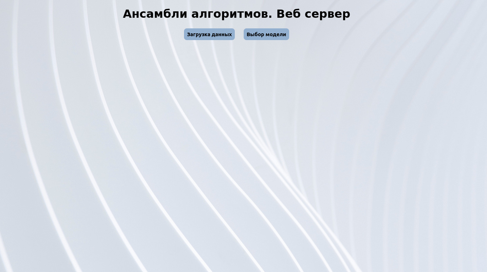
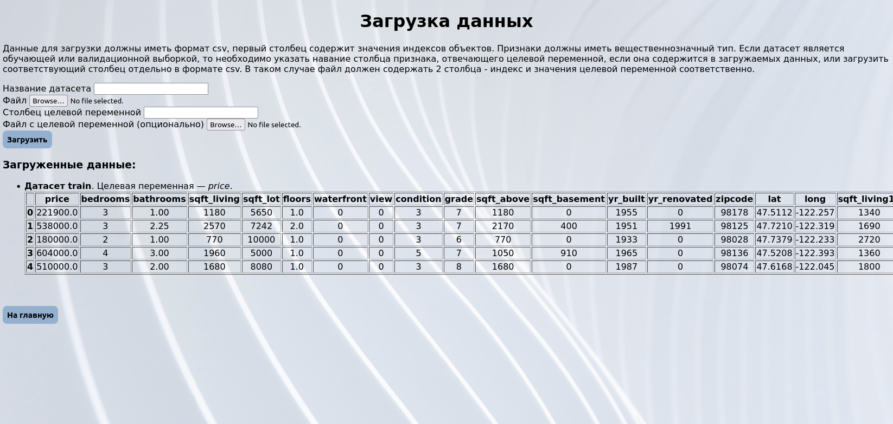
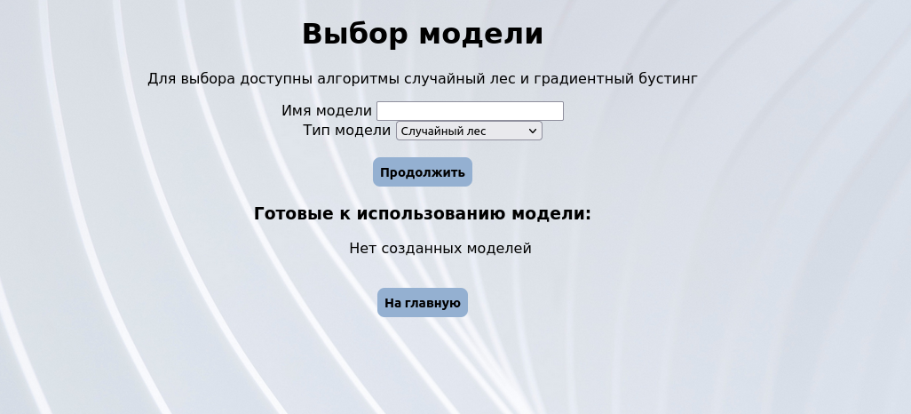
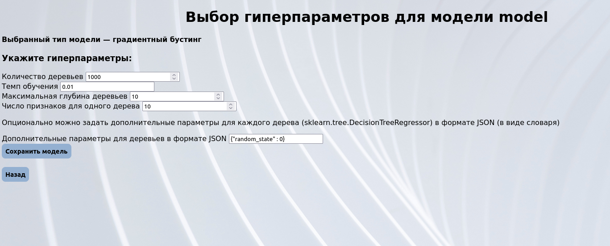
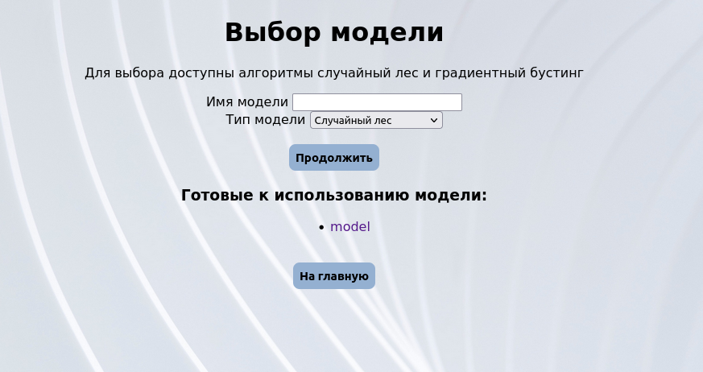
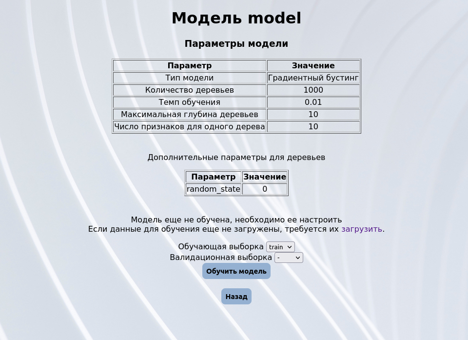
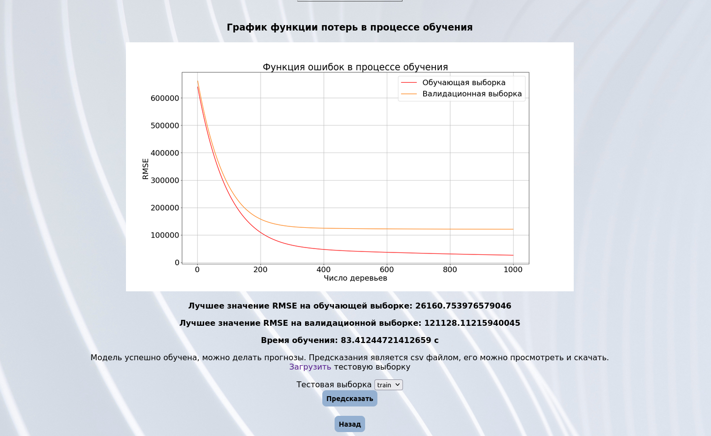

# Практикум на ЭВМ, задание 3. Ансамбли алгоритмов. Веб-сервер. Композиции алгоритмов для решения задачи регрессии.

Данный сервис позволяет строить модели двух типов, случайный лес и градиентный бустинг, настраивать их, обучать и применять на загружаемых данных, делать предсказания.

## Стартовая страница

Можно перейти к загрузке данных или выбору моделей

## Загрузка данных

Данные должны иметь формат .csv, при загрузке необходимо указать файл, задать имя датасета и указать название столбца с целевой переменной, если таковой содержится в данных. В противном случае можно загрузить столбец целевой переменной отдельно, также в формате .csv, состоящий из двух столбцов - индекса и значений соответственно. Если загружается тестовая выборка, то, естественно, указывать имя таргета не нужно. В репозитории в директории data_examples можно увидеть примеры данных для обучения, валидации и тестирования, подходящие требованиям реализации. Данные должны иметь вещественнозначный тип. Загруженные данные будут постепенно отображаться по мере появления.

## Выбор и настройка модели

К обучению доступны модели двух типов - случайный лес и градиентный бустинг. Модели необходимо задать имя.

После необходимо задать гиперпараметры модели. Можно опционально указать дополнительные параметры для базовых алгоритмов (sklearn.tree.DecisionTreeRegressor) в формате JSON, т. е. в виде строки, представляющей собой последовательность пар вида "имя_параметра" : значение, разделенных через запятую, заключенную в фигурные скобки. Кавычки допустимы только двойные, и все строковые значения также должны быть заключены в кавычки.

После создания модель появится в списке доступных к использованию.

## Обучение и предсказание

На странице модели указана вся соответствующая информация о ней. Перед использованием необходимо обучить ее на загруженных данных. Опционально можно указать данные для валидации в процессе обучения. 

После завершения обучения отобразится график динамики ошибки RMSE в процессе обучения на обучении и валидации. Также будет выведена информация о лучших значениях RMSE в процессе обучения и времени обучения.

Далее можно использовать модель для предсказаний, выбрав соответствующую тестовую выборку. Когда результат будет готов, будет предложено сохранить файл в формате csv с предсказанием или просмотреть его в любой программе для чтения данного формата на компьютере пользователя. 

## Сборка контейнера с приложением

Для сборки контейнера можно запустить скрипт build.sh из директории scripts или же непосредственно использовать команду:

    sudo docker build -t app .

## Запуск контейнера

Для запуска контейнера можно запустить скрипт run.sh из директории scripts или же непосредственно использовать команду:

    sudo docker run -p 5000:5000 -i app

## Эксперименты и отчет о практическом задании

Отчет к заданию расположен непосредственно в самом репозитории. ipynb-файл с сопутствующими экспериментами находится в директории research
